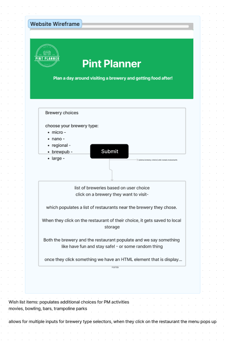

# Pint Planner Project

## Description

Trying to plan a day out? Which brewery? Which restaurants? This project helps by giving you some options for breweries in Austin, and then providing some restaurant choices based on which brewery you select. 

## Table of Contents (Optional)

- [Deployment](#deployment)
- [Features](#features)
- [Usage](#usage)
- [Development](#development)
- [Credits](#credits)
- [Authors](#authors)
- [License](#license)
- [Acknowledgments](#acknowledgments)

## Deployment

GitHub Pages!

## Features

* Look up a list of breweries based on the type you would like
* Find a list of restaurants near the selected brewery
* View your selected options and be able to restart by hitting the clear button

## Usage

Simply open the browser to get started and follow these instructions.
1. Click on the type of brewery you would like to go to.

2. Click on the restaurant you would like to go to.

3. Your results are at the bottom of the page, if you'd like to restart just hit the clear button.

## Development

We started with our wireframe below.

[Wireframe](https://www.figma.com/file/xI8NdwBHwYa0Rs3ASuZl3T/DayTrip-Planner?node-id=1%3A538&t=Oa1BGRsT8s8aIFhT-1)

We used the following color palette. 

## Credits

Open Brewery Database API [Github](https://github.com/openbrewerydb/openbrewerydb#readme)

Restaurants Near Me USA API [Rapid API](https://rapidapi.com/makingdatameaningful/api/restaurants-near-me-usa/)

## Authors

Camelia Benavides [Github](https://github.com/cameliabenavides10)

Karen Peazooni [Github](https://github.com/kpeazzoni)

Michael Smith [Github](https://github.com/AustinBQ02)

Reuben Schmolke [Github](https://github.com/RoobyDoobster)

## License

Please see LICENSE file.

## Acknowledgments

- [RapidAPI](https://rapidapi.com/hub)
- [Materialize](https://materializecss.com)
- [W3Schools](https://www.w3schools.com)
- [Stack OverFlow](https://stackoverflow.com)